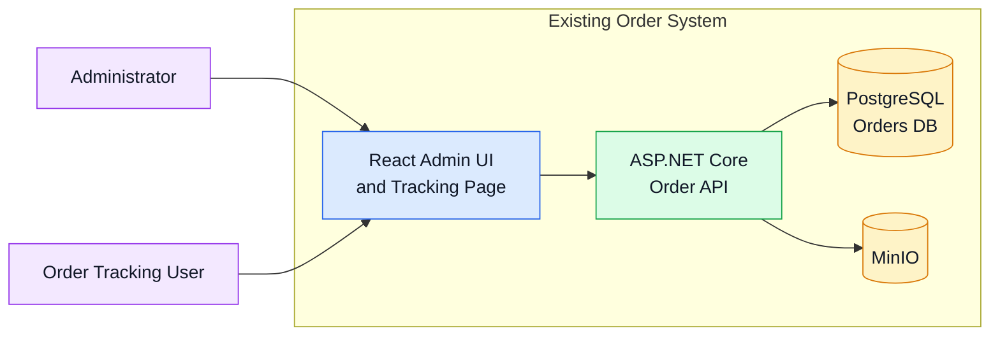
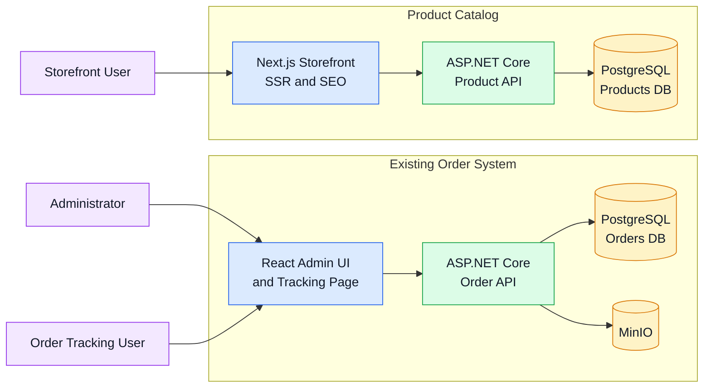
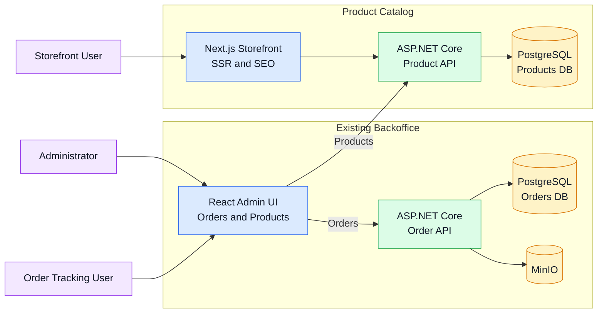
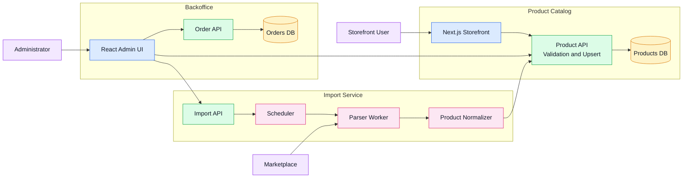
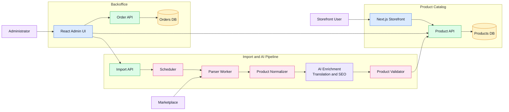
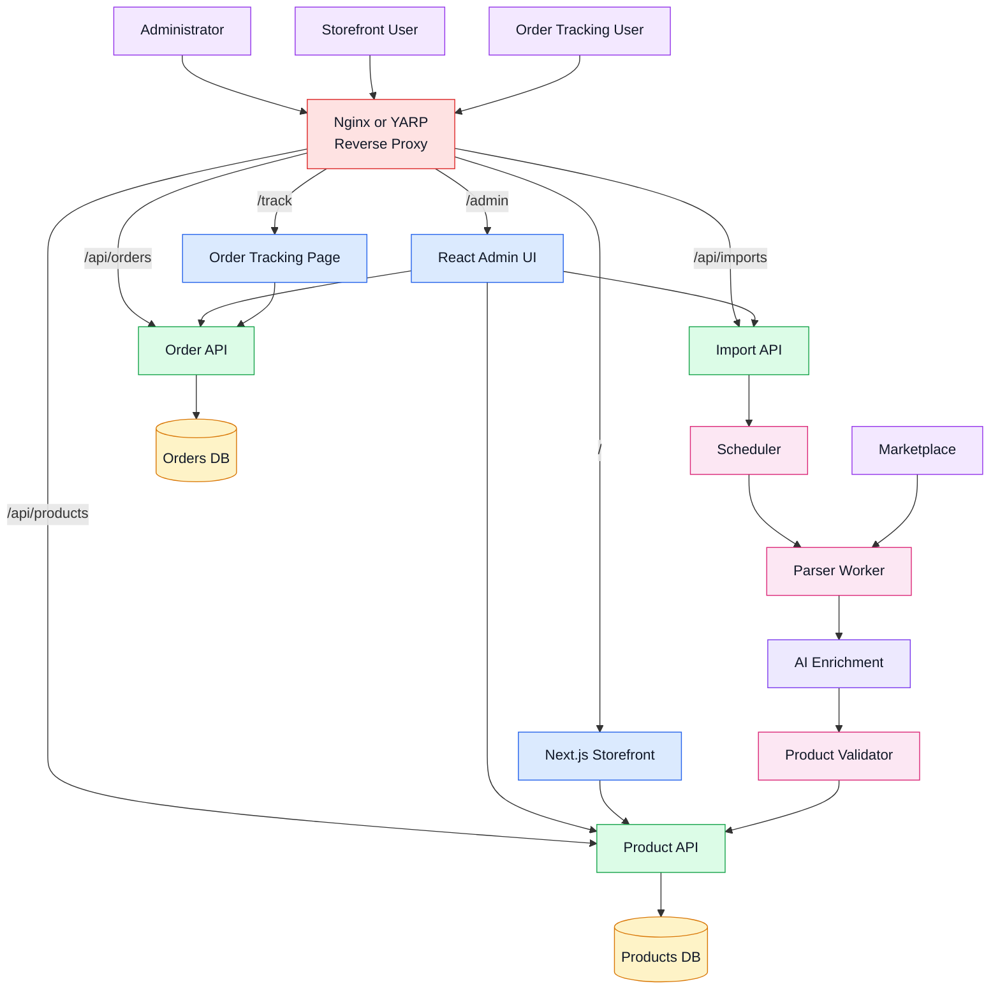
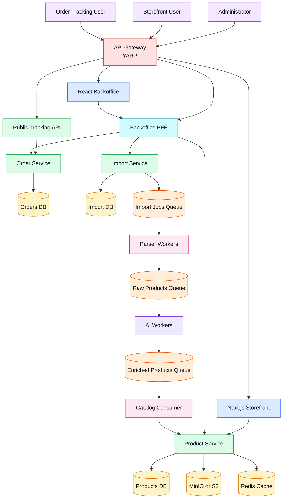
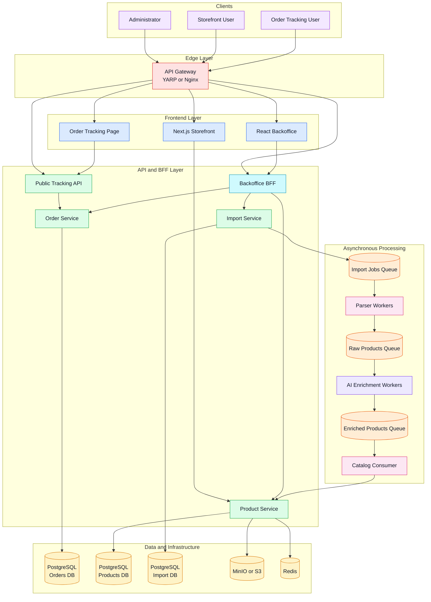

# Order Tracking System

Internal CRM for managing customer orders with public QR-based tracking.

## Tech stack

- **Backend:** ASP.NET Core (.NET 10), EF Core, PostgreSQL, MediatR, FluentValidation, CQRS
- **Frontend:** React, TypeScript, Vite, TailwindCSS, TanStack Query, react-i18next (RU/EN)
- **Deployment:** Docker Compose (single VPS)

## Project structure

```
order-tracking/
├── docker/                 # Dockerfiles
├── src/
│   ├── backend/            # .NET solution (OrderTracking.slnx)
│   └── frontend/           # React SPA → bundled into API wwwroot
├── docker-compose.yml
└── .env.example
```

## Prerequisites

- [.NET SDK 10](https://dotnet.microsoft.com/download)
- [Node.js 22+](https://nodejs.org/)
- [Docker Desktop](https://www.docker.com/products/docker-desktop/) (optional, for full stack)

## Quick start (local development)

### 1. PostgreSQL

```powershell
docker compose up postgres -d
```

Default host port is **5433** (to avoid conflict with a local PostgreSQL on 5432).

### 2. Backend API

```powershell
cd src/backend
dotnet run --project OrderTracking.Api
```

API: `http://localhost:5280`  
Health: `http://localhost:5280/health`  
Ping: `http://localhost:5280/api/v1/ping`

### 3. Frontend (dev server)

```powershell
cd src/frontend
npm install
npm run dev
```

UI: `http://localhost:5173` (proxies `/api` → backend)

## Docker (full stack)

```powershell
cp .env.example .env
docker compose up --build
```

App: `http://localhost:8080`

## Auth tokens (planned)

| Token | TTL |
|-------|-----|
| Access JWT | 24 hours |
| Refresh token | 7 days (HttpOnly cookie, rotation) |

## Implementation phases

- [x] **Phase 0** — Scaffold, Docker, health checks, i18n shell
- [x] **Phase 1** — Domain entities, EF migrations, DB schema, seed statuses
- [x] **Phase 2** — Identity (JWT + refresh), seed admin
- [x] **Phase 3** — Customers CRUD
- [x] **Phase 4** — Orders Core (create, list, search, NanoId)
- [x] **Phase 5** — Order Items add/edit/delete
- [x] **Phase 6** — Status updates + history + status definitions
- [x] **Phase 7** — Public Tracking API
- [x] **Phase 8** — QR & tracking links polish
- [x] **Phase 9** — Audit log write + Correlation ID
- [x] **Phase 10** — Dashboard aggregates API + UI

# Architecture

## Stage 0 (Current)



---

## Stage 1



---

## Stage 2



---

## Stage 3



---

## Stage 4



---

## Stage 5



---

## Stage 6

```mermaid
flowchart LR
    Admin[Administrator]
    ReactAdmin["React Admin UI"]
    ImportApi["Import API and Scheduler"]

    Admin --> ReactAdmin
    ReactAdmin --> ImportApi

    ImportApi --> ImportQueue[("Import Jobs Queue")]

    ImportQueue --> RakutenParser["Rakuten Parser"]
    ImportQueue --> AmazonParser["Amazon Parser"]
    ImportQueue --> YahooParser["Yahoo Parser"]
    ImportQueue --> OtherParser["Other Parser"]

    RakutenParser --> RawQueue[("Raw Products Queue")]
    AmazonParser --> RawQueue
    YahooParser --> RawQueue
    OtherParser --> RawQueue

    RawQueue --> AiWorker1["AI Worker 1"]
    RawQueue --> AiWorker2["AI Worker 2"]
    RawQueue --> AiWorkerN["AI Worker N"]

    AiWorker1 --> EnrichedQueue[("Enriched Products Queue")]
    AiWorker2 --> EnrichedQueue
    AiWorkerN --> EnrichedQueue

    EnrichedQueue --> CatalogConsumer["Catalog Consumer"]
    CatalogConsumer --> ProductApi["Product API"]
    ProductApi --> ProductDb[("Products DB")]

    NextJs["Next.js Storefront"] --> ProductApi
    ReactAdmin --> ProductApi

    classDef frontend fill:#dbeafe,stroke:#2563eb,color:#111827
    classDef service fill:#dcfce7,stroke:#16a34a,color:#111827
    classDef worker fill:#fce7f3,stroke:#db2777,color:#111827
    classDef ai fill:#ede9fe,stroke:#7c3aed,color:#111827
    classDef queue fill:#ffedd5,stroke:#ea580c,color:#111827
    classDef database fill:#fef3c7,stroke:#d97706,color:#111827
    classDef external fill:#f3e8ff,stroke:#9333ea,color:#111827

    class ReactAdmin,NextJs frontend
    class ImportApi,ProductApi service
    class RakutenParser,AmazonParser,YahooParser,OtherParser,CatalogConsumer worker
    class AiWorker1,AiWorker2,AiWorkerN ai
    class ImportQueue,RawQueue,EnrichedQueue queue
    class ProductDb database
    class Admin external
```



---

## Stage 7



---

## Final Architecture




## Environment variables

See [.env.example](.env.example).

## License

Private / internal use.
